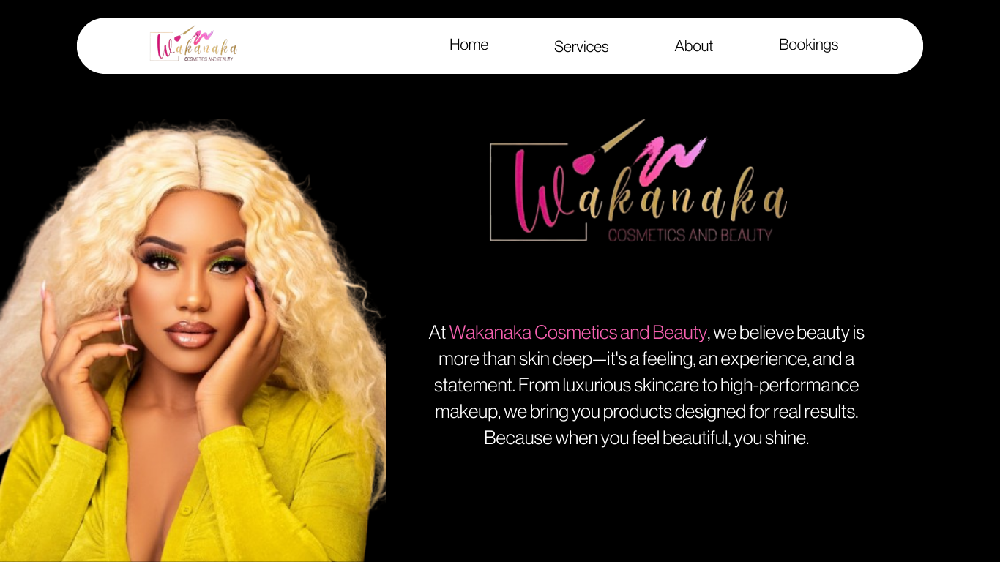
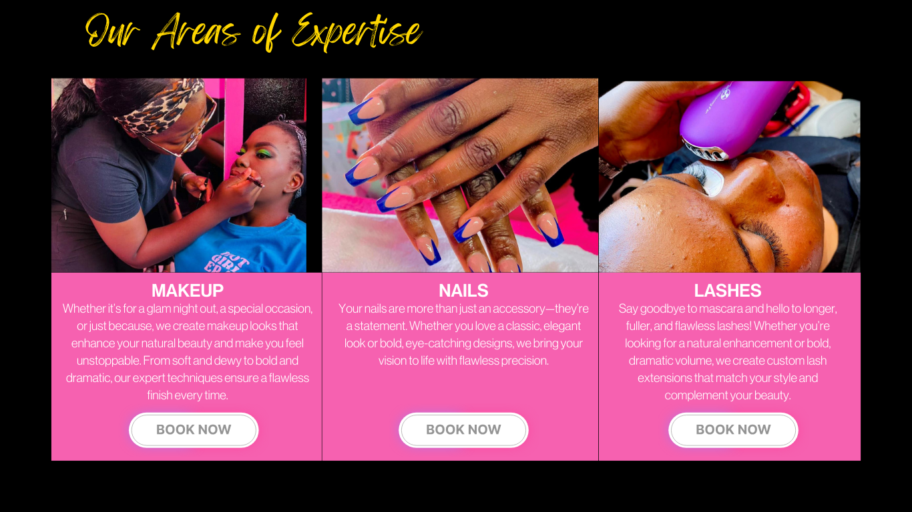
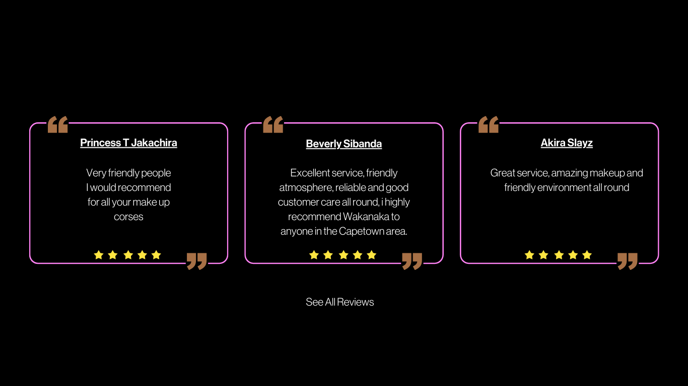
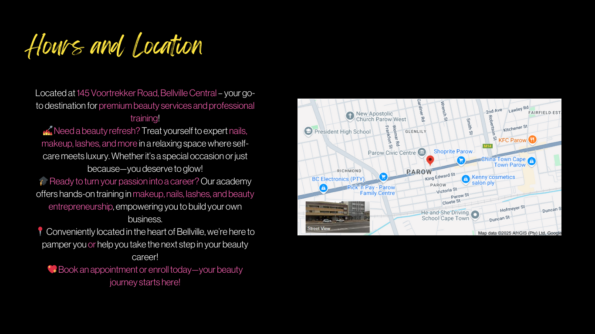
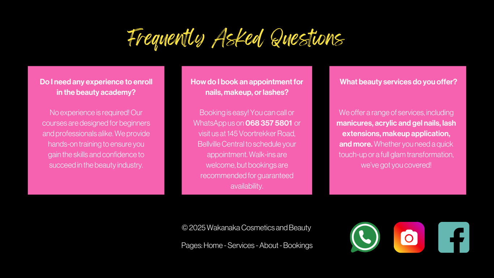

# wakanaka_beauty_academy_design
A UI/UX design made for a beauty academy in Cape Town.

Wakanaka Beauty — Website Design

A modern, elegant website design concept for Wakanaka Beauty, a beauty brand offering professional makeup, nail and eyelash services alongside a dedicated beauty academy.

Overview

The goal of this project was to create a polished digital experience that represents Wakanaka Beauty as both a premium beauty service provider and a professional beauty education brand.

The design was created to serve two key audiences:

Clients looking to book beauty treatments
Aspiring beauty professionals interested in enrolling in the Wakanaka Beauty Academy

The website therefore balances visual appeal and lifestyle branding with clear information and calls-to-action.

Project Goals
Create a modern and visually appealing online presence
Showcase Wakanaka Beauty's range of beauty services
Make it easy for clients to discover and enquire about treatments
Establish the Beauty Academy as a credible educational offering
Clearly separate beauty services from academy information
Create a strong and consistent brand identity
Guide visitors towards booking a service or exploring the academy
Key Features
Beauty Services Showcase

The website highlights Wakanaka Beauty's core services, including:

Makeup
Nails
Eyelashes

Each service is presented with an emphasis on the quality, creativity and personalised experience offered to clients.

Beauty Academy

A dedicated section introduces the Wakanaka Beauty Academy, allowing prospective students to learn more about the educational side of the brand.

The academy section is designed to communicate:

Available training
The learning experience
Opportunities for aspiring beauty professionals
How prospective students can enquire or enrol
Service & Academy CTAs

The design uses clear calls-to-action to guide visitors towards the appropriate next step.

For beauty clients:

Book a Treatment

For prospective students:

Explore the Academy

This helps prevent the two audiences from competing for the same attention.

Visual Portfolio

Photography and visual content play a central role in the design, allowing Wakanaka Beauty to showcase the quality of its work through:

Makeup looks
Nail designs
Eyelash treatments
Beauty transformations
Academy work
Design Direction

The design focuses on creating a feminine, elegant and contemporary beauty aesthetic.

The visual direction prioritises:

Elegant typography
Clean layouts
High-quality beauty imagery
Soft visual hierarchy
Strong use of whitespace
Clear calls-to-action
Consistent brand presentation

The intention is to make the website feel like an extension of the Wakanaka Beauty experience rather than simply an online service catalogue.

User Experience Strategy

The website is structured around the two primary customer journeys:

Beauty Client

Discover → Explore Services → View Work → Book / Enquire

Academy Student

Discover Academy → Learn About Courses → Explore Opportunities → Enquire / Enrol

This structure allows visitors to quickly identify which part of Wakanaka Beauty is relevant to them.

Conversion Strategy

The design was created with conversion in mind.

Rather than overwhelming visitors with information, the website uses strategically placed calls-to-action to encourage users to take the next step.

Key conversion opportunities include:

Booking beauty treatments
Enquiring about services
Exploring the academy
Enquiring about courses
Starting the enrolment process

Project Focus

This project demonstrates the ability to design a digital experience for a brand with multiple customer segments and revenue streams.

Rather than treating Wakanaka Beauty purely as a beauty salon, the design positions the brand as both:

A beauty destination for clients

and

A platform for developing future beauty professionals.

Client

Wakanaka Beauty

Beauty services and professional beauty education.

Project Outcome

The design aims to give Wakanaka Beauty a stronger digital presence while making its two primary offerings immediately understandable.

The final concept combines beauty, education and brand identity into one cohesive experience, with a clear focus on turning visitors into either clients or prospective students.
